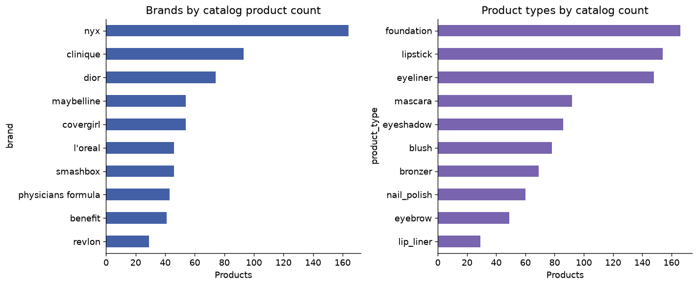

# Cosmetics Catalog Analysis and Data Quality

Analyzed a 931-product cosmetics catalog using Python and pandas, exploring brand coverage, product types, pricing and ratings. Improved the analysis by preserving missing values and separating currencies. Identified substantial rating and currency gaps that prevent a reliable price–rating comparison, turning the project into a transparent, evidence-based catalog analysis rather than making unsupported market claims.

## What a cosmetics catalog can—and cannot—tell us

A cosmetics catalog looks like a natural place to compare brands, prices and ratings. But a chart is only as credible as the records behind it. This project begins by asking which comparisons the available fields actually support.

The revised workflow audits coverage, preserves missing values and separates currencies before summarizing products. Brand and product-type charts describe catalog coverage, while the missingness chart explains the limits of price and rating analysis.

NYX has the most entries in this catalog, but that is not a sales ranking. Every rated row lacks currency information, so the strongest finding is a clear boundary on what a price–rating analysis can establish.

## Status

Executed successfully; measured results saved.

## Method

Audited missingness, duplicates, invalid prices and ratings; preserved missing values as missing. Compared brand/product coverage and summarized prices within currency. Kept product type distinct from subcategory and separated catalog counts from sales or market share.

## Measured results

See `results/metrics.json` and the accompanying aggregate CSV files for all measured findings.

## Limits and interpretation

This catalog contains 931 products. Ratings are missing for 63.48% and currency for 60.47%; all 340 rated rows lack a currency. None of the rows with known currency has a rating, so a currency-controlled price–rating correlation cannot be estimated. Zero prices may represent unavailable prices. The privately saved Colab/Kaggle final version has not been inspected.

## Data

Supply local output.csv.zip containing output.csv, or the extracted CSV. Required columns: brand, name, category, product_type, currency, price, rating. Source rights have not been independently confirmed, so raw data is excluded.

## Reproduce

Run from this project directory in an isolated Python environment. The tabular projects were executed with Python 3.12; the deep-learning projects used Python 3.11 on CPU.

```shell
python -m venv .venv
# Activate .venv using your shell's activation command.
python -m pip install -r requirements.txt
python analyze.py --data output.csv --out results
```

`analysis.ipynb` is an executed results-review notebook. It displays saved outputs by default; its optional training cell can rerun the experiment after the dataset path is configured. Training scripts were executed separately to produce the recorded results. The original public `output.csv` and `cosmetics-analysis.ipynb` are retained from this existing repository. Generated caches and model files are ignored. Only load model files you created or trust.

## Files

- `train.py` or `analyze.py`: complete experiment or analysis.
- `common.py`: metric, figure and reproducibility helpers.
- `results/metrics.json`: measured outcomes, data fingerprint and environment.
- `results/*.csv` and `results/*.png`: aggregate tables and figures.
- `analysis.ipynb`: reproducible review and optional rerun instructions.
- `project-description.md`: LinkedIn-ready description and skills.

## Figures




## Attribution

Portfolio project by Nourah Alotaibi. This package refactors the collected project into a new reproducible workflow. Dataset providers, upstream libraries and pretrained-model authors retain their respective rights. This repository does not grant a new license to third-party data or models.

## Existing project preserved

The original `cosmetics-analysis.ipynb` and `output.csv` remain available. This update adds the reproducible analysis, executed results review, figures and project narrative alongside them.

The existing CSV is byte-identical to the CSV inside the local archive used for the recorded results.
